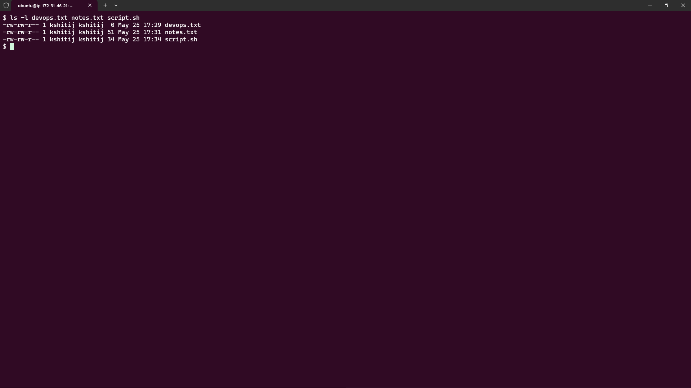
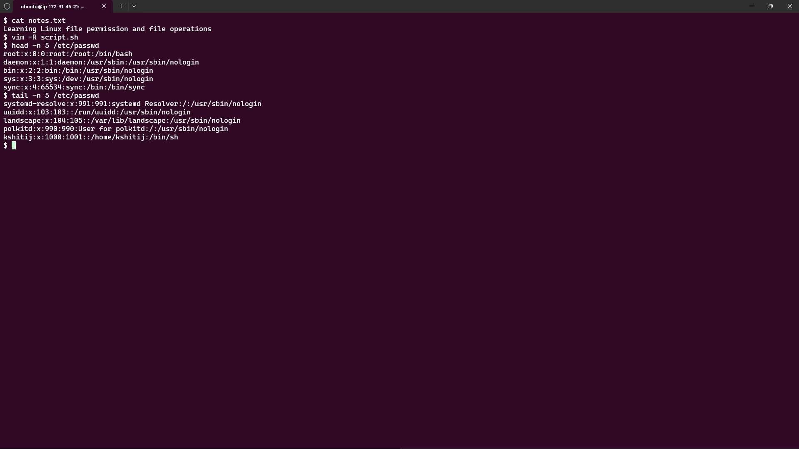
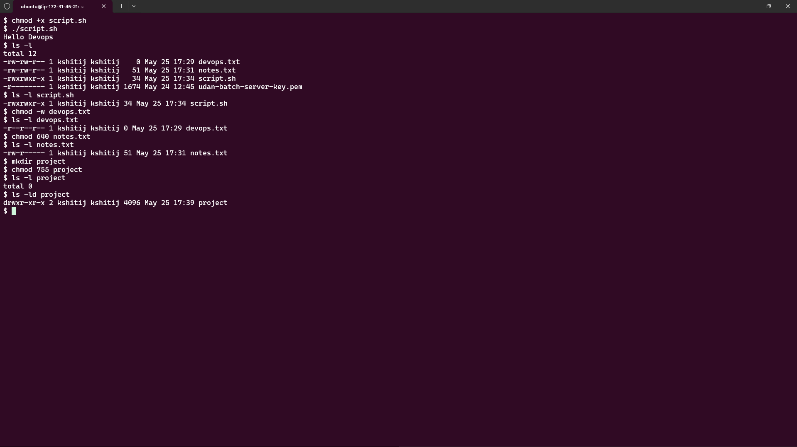
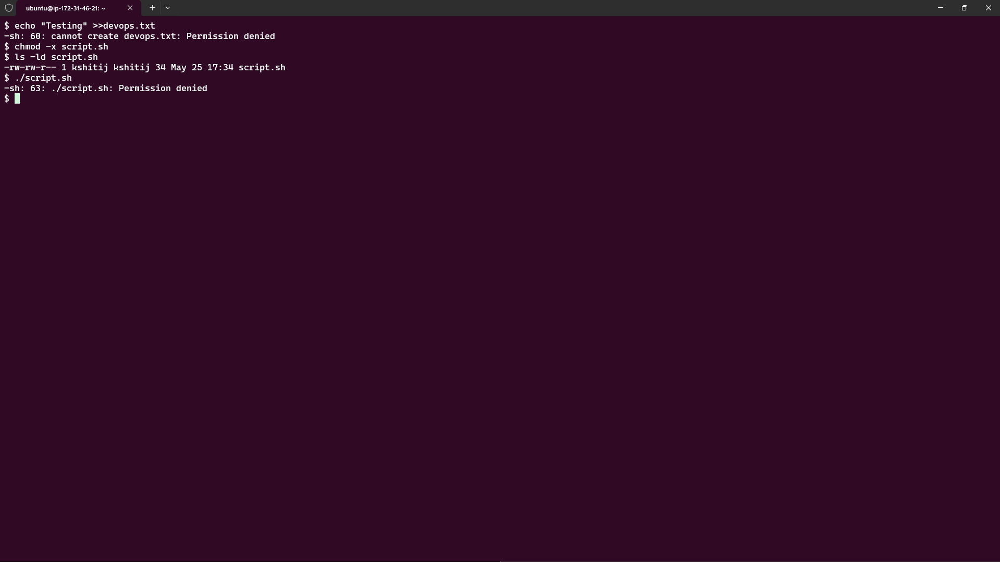

# Day 10 Challenge – File Permissions & File Operations

## Objective

The goal of this challenge was to learn:

- Creating files in Linux
- Reading file contents
- Understanding Linux file permissions
- Modifying permissions using chmod
- Testing file access and execution permissions

---

# Task 1: Create Files

## Create Empty File

```bash
touch devops.txt
```

## Create notes.txt with Content

```bash
echo "Learning Linux file permissions and file operations." > notes.txt
```

## Create script.sh

```bash
vim script.sh
```

Content:

```bash
echo "Hello DevOps"
```

## Verify Files

```bash
ls -l
```


### Screenshot



---

# Task 2: Read Files

## Read notes.txt

```bash
cat notes.txt
```

### Output

```text
Learning Linux file permissions and file operations.
```

---

## View script.sh in Read-Only Mode

```bash
vim -R script.sh
```

---

## Display First 5 Lines of /etc/passwd

```bash
head -n 5 /etc/passwd
```


## Display Last 5 Lines of /etc/passwd

```bash
tail -n 5 /etc/passwd
```

### Screenshot



---

# Task 3: Understand Permissions

## Check Current Permissions

```bash
ls -l devops.txt notes.txt script.sh
```
---

## Permission Breakdown

Example:

```text
-rw-rw-r--
```

| Section | Meaning |
|----------|----------|
| rw- | Owner can read and write |
| rw- | Group can read and write |
| r-- | Others can only read |

### Numeric Values

| Permission | Value |
|------------|-------|
| Read (r) | 4 |
| Write (w) | 2 |
| Execute (x) | 1 |

Examples:

| Numeric | Symbolic |
|----------|----------|
| 777 | rwxrwxrwx |
| 755 | rwxr-xr-x |
| 644 | rw-r--r-- |
| 640 | rw-r----- |

---

# Task 4: Modify Permissions

## Make script.sh Executable

```bash
chmod +x script.sh
```

Verify:

```bash
ls -l script.sh
```


Run Script:

```bash
./script.sh
```

---

## Make devops.txt Read-Only

Remove write permission for everyone:

```bash
chmod a-w devops.txt
```

Verify:

```bash
ls -l devops.txt
```

---

## Set notes.txt Permission to 640

```bash
chmod 640 notes.txt
```

Verify:

```bash
ls -l notes.txt
```

Meaning:

- Owner → Read + Write
- Group → Read
- Others → No Access

---

## Create project Directory with 755

```bash
mkdir project
chmod 755 project
```

Verify:

```bash
ls -ld project
```

### Screenshot



---

# Task 5: Test Permissions

## Try Writing to Read-Only File

```bash
echo "Testing" >> devops.txt
```
---

## Remove Execute Permission

```bash
chmod -x script.sh
```

Verify:

```bash
ls -l script.sh
```
---

## Try Executing Script

```bash
./script.sh
```

### Screenshot



---

# Files Created

| File | Purpose |
|--------|----------|
| devops.txt | Empty file created using touch |
| notes.txt | Text file containing notes |
| script.sh | Shell script printing Hello DevOps |
| project/ | Directory for permission testing |

---

# Permission Changes

| File/Directory | Before | After |
|---------------|---------|---------|
| script.sh | rw-rw-r-- | rwxrwxr-x |
| devops.txt | rw-rw-r-- | r--r--r-- |
| notes.txt | rw-rw-r-- | rw-r----- |
| project | default | rwxr-xr-x (755) |

---

# Commands Used

```bash
touch
echo
cat
vim
head
tail
ls
chmod
mkdir
./script.sh
```

---

# What I Learned

### 1. Linux File Permissions Control Access

Every file and directory has owner, group, and others permissions.

### 2. chmod Modifies Permissions

Permissions can be changed using symbolic or numeric methods.

Examples:

```bash
chmod +x file
chmod -w file
chmod 755 directory
chmod 640 file
```

### 3. Execute Permission Is Required

A script cannot be executed unless it has execute permission.

### 4. Read-Only Files Prevent Modification

Removing write permission protects files from accidental changes.

### 5. Numeric Permission Values

- 7 = rwx
- 6 = rw-
- 5 = r-x
- 4 = r--
- 0 = ---

---

# Conclusion

Successfully completed Day 10 challenge by:

✅ Creating files and directories  
✅ Reading file contents using cat, head, and tail  
✅ Understanding Linux permission structure  
✅ Modifying permissions using chmod  
✅ Running executable scripts  
✅ Testing and documenting permission errors

---

### Hashtags

#90DaysOfDevOps  
#DevOpsKaJosh  
#TrainWithShubham