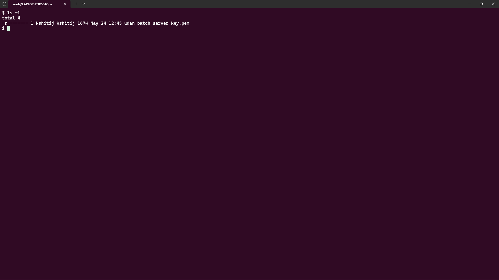
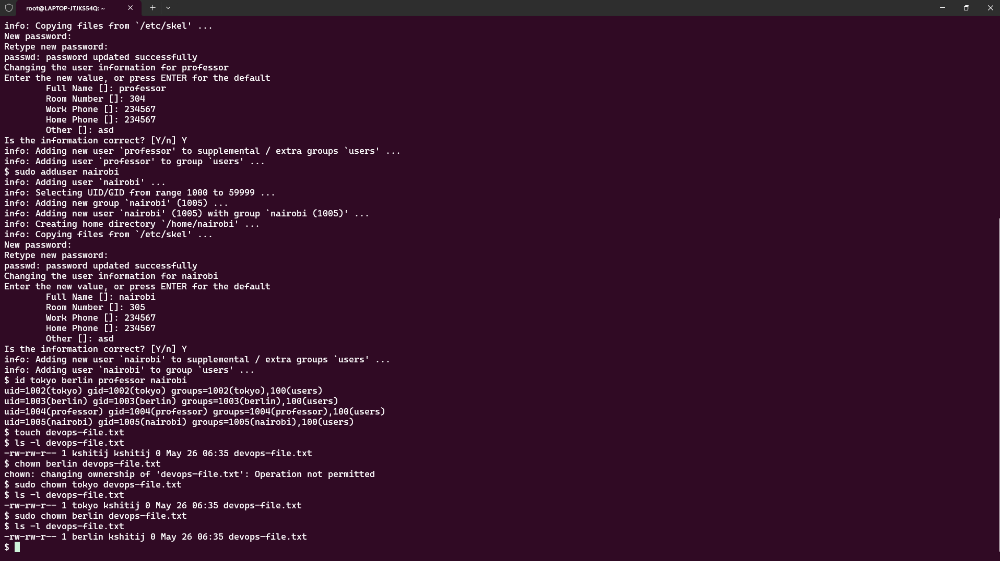
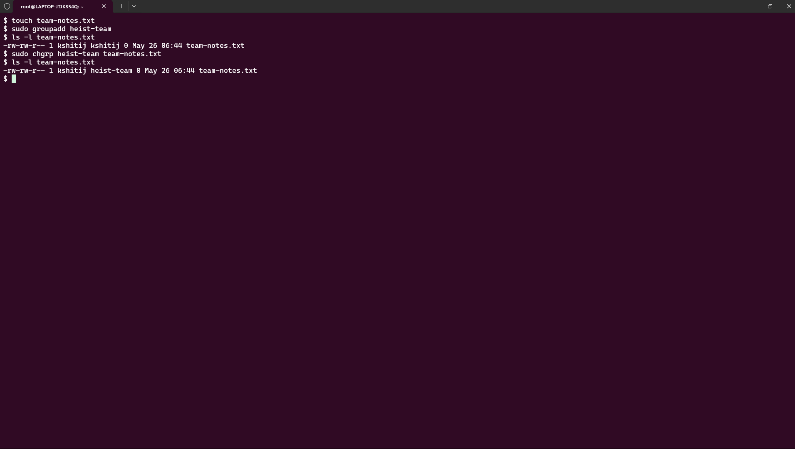
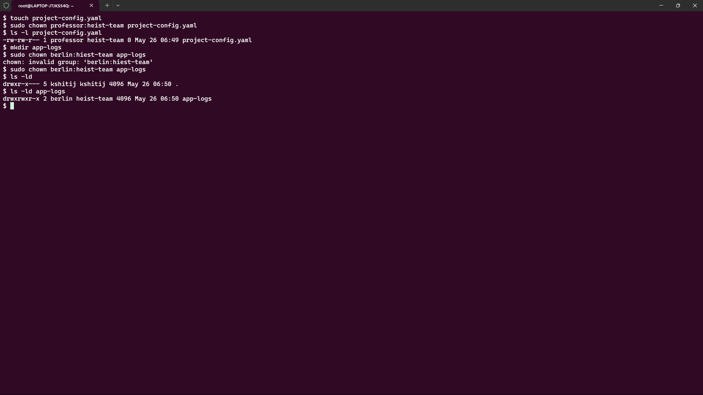
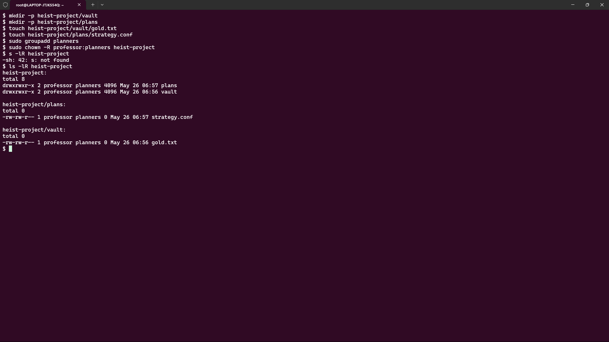
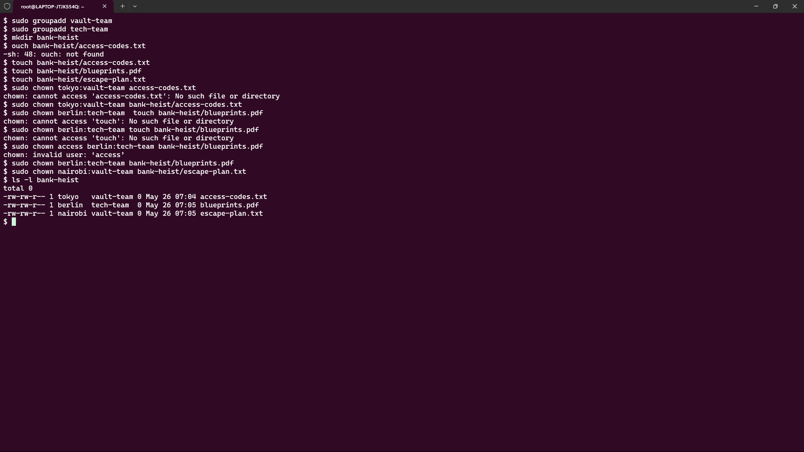

# Day 11 Challenge – File Ownership (chown & chgrp)

## Objective

The objective of this challenge was to understand Linux file ownership and group ownership by using `chown` and `chgrp` commands. I learned how to change file owners, assign groups, modify ownership recursively, and manage ownership for directories and files in a structured environment.

---

# Task 1: Understanding Ownership

## Commands Used

```bash
ls -l
```

## Sample Output

```text
-r-------- 1 kshitij kshitij 1674 May 24 12:45 udan-batch-server-key.pem
```

### Ownership Structure

| Field | Description |
|---------|------------|
| Owner | User who owns the file |
| Group | Group associated with the file |

### Difference Between Owner and Group

- **Owner** is the individual user who has primary control over the file.
- **Group** is a collection of users who can access the file according to the assigned group permissions.

### Screenshot



---

# Task 2: Basic chown Operations

## Create File

```bash
touch devops-file.txt
```

## Check Current Ownership

```bash
ls -l devops-file.txt
```

### Before

```text
-rw-rw-r-- 1 kshitij kshitij 0 May 26 06:35 devops-file.txt
```
## Change Owner to Tokyo

```bash
sudo chown tokyo devops-file.txt
```

### Verify

```bash
ls -l devops-file.txt
```

```text
-rw-rw-r-- 1 tokyo kshitij 0 May 26 06:35 devops-file.txt
```

## Change Owner to Berlin

```bash
sudo chown berlin devops-file.txt
```

### Verify

```text
-rw-rw-r-- 1 berlin kshitij 0 May 26 06:35 devops-file.txt
```
### Screenshot



---

# Task 3: Basic chgrp Operations

## Create File

```bash
touch team-notes.txt
```
## Create Group

```bash
sudo groupadd heist-team
```

## Check Current Group

```bash
ls -l team-notes.txt
```

## Change Group Ownership

```bash
sudo chgrp heist-team team-notes.txt
```

## Verify

```bash
ls -l team-notes.txt
```

### Output

```text
-rw-rw-r-- 1 kshitij heist-team 0 May 26 06:44 team-notes.txt
```

### Screenshot



---

# Task 4: Combined Owner & Group Change

## Create File

```bash
touch project-config.yaml
```

## Change Owner and Group Together

```bash
sudo chown professor:heist-team project-config.yaml
```

## Verify

```bash
ls -l project-config.yaml
```

### Output

```text
-rw-rw-r-- 1 professor heist-team 0 May 26 06:49 project-config.yaml
```

---

## Create Directory

```bash
mkdir app-logs
```
## Change Directory Owner and Group

```bash
sudo chown berlin:heist-team app-logs
```

## Verify

```bash
ls -ld app-logs
```

### Output

```text
drwxrwxr-x 2 berlin heist-team 4096 May 26 06:50 app-logs
```

### Screenshot



---

# Task 5: Recursive Ownership

## Create Directory Structure

```bash
mkdir -p heist-project/vault
mkdir -p heist-project/plans

touch heist-project/vault/gold.txt
touch heist-project/plans/strategy.conf
```

## Create Group

```bash
sudo groupadd planners
```

## Apply Recursive Ownership

```bash
sudo  chown -R professor:planners heist-project
```

## Verify

```bash
ls -lR heist-project
```

### Sample Output

```text
heist-project:
total 8
drwxrwxr-x 2 professor planners 4096 May 26 06:57 plans
drwxrwxr-x 2 professor planners 4096 May 26 06:56 vault

heist-project/plans:
total 0
-rw-rw-r-- 1 professor planners 0 May 26 06:57 strategy.conf

heist-project/vault:
total 0
-rw-rw-r-- 1 professor planners 0 May 26 06:56 gold.txt
```

### Screenshot



---

# Task 6: Practice Challenge

## Create Groups

```bash
sudo groupadd vault-team
sudo groupadd tech-team
```

## Create Directory

```bash
mkdir bank-heist
```

## Create Files

```bash
touch bank-heist/access-codes.txt
touch bank-heist/blueprints.pdf
touch bank-heist/escape-plan.txt
```

## Assign Ownership

```bash
sudo chown tokyo:vault-team bank-heist/access-codes.txt

sudo chown berlin:tech-team bank-heist/blueprints.pdf

sudo chown nairobi:vault-team bank-heist/escape-plan.txt
```

## Verify

```bash
ls -l bank-heist
```

### Output

```text
total 0
-rw-rw-r-- 1 tokyo   vault-team 0 May 26 07:04 access-codes.txt
-rw-rw-r-- 1 berlin  tech-team  0 May 26 07:05 blueprints.pdf
-rw-rw-r-- 1 nairobi vault-team 0 May 26 07:05 escape-plan.txt
```

### Screenshot



---

# Files & Directories Created

## Files

- devops-file.txt
- team-notes.txt
- project-config.yaml
- heist-project/vault/gold.txt
- heist-project/plans/strategy.conf
- bank-heist/access-codes.txt
- bank-heist/blueprints.pdf
- bank-heist/escape-plan.txt

## Directories

- app-logs
- heist-project
- heist-project/vault
- heist-project/plans
- bank-heist

---

# Ownership Changes

| File/Directory | Before | After |
|----------------|---------|--------|
| devops-file.txt | root:root | berlin:root |
| team-notes.txt | root:root | root:heist-team |
| project-config.yaml | root:root | professor:heist-team |
| app-logs | root:root | berlin:heist-team |
| heist-project/* | root:root | professor:planners |
| access-codes.txt | root:root | tokyo:vault-team |
| blueprints.pdf | root:root | berlin:tech-team |
| escape-plan.txt | root:root | nairobi:vault-team |

---

# Commands Used

```bash
ls
touch
mkdir
groupadd
chown
chgrp
id
ls -l
ls -ld
ls -lR
```

---

# What I Learned

### 1. File Ownership Controls Access

Every file in Linux belongs to a user (owner) and a group.

### 2. chown Can Change Both Owner and Group

Using:

```bash
chown owner:group filename
```

allows ownership and group changes in a single command.

### 3. Recursive Ownership Is Powerful

The `-R` option allows ownership changes for entire directory structures, including all files and subdirectories.

### 4. Group Ownership Enables Collaboration

Assigning files to a shared group makes team-based access management easier.

### 5. Ownership Management Is Critical in DevOps

Proper ownership is required for:

- Application deployments
- Shared team environments
- Containerized applications
- Log management
- CI/CD pipelines
---

# Conclusion

Successfully completed Day 11 challenge by:

✅ Understanding Linux ownership structure  
✅ Changing file owners using `chown`  
✅ Changing file groups using `chgrp`  
✅ Modifying owner and group together  
✅ Applying recursive ownership changes  
✅ Managing ownership across multiple users and groups

---

### Hashtags

#90DaysOfDevOps  
#DevOpsKaJosh  
#TrainWithShubham