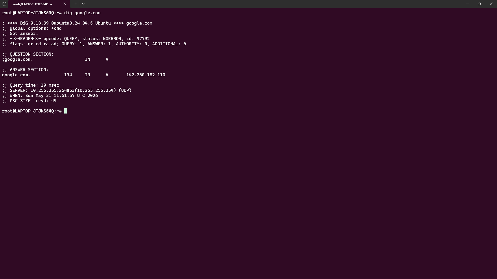
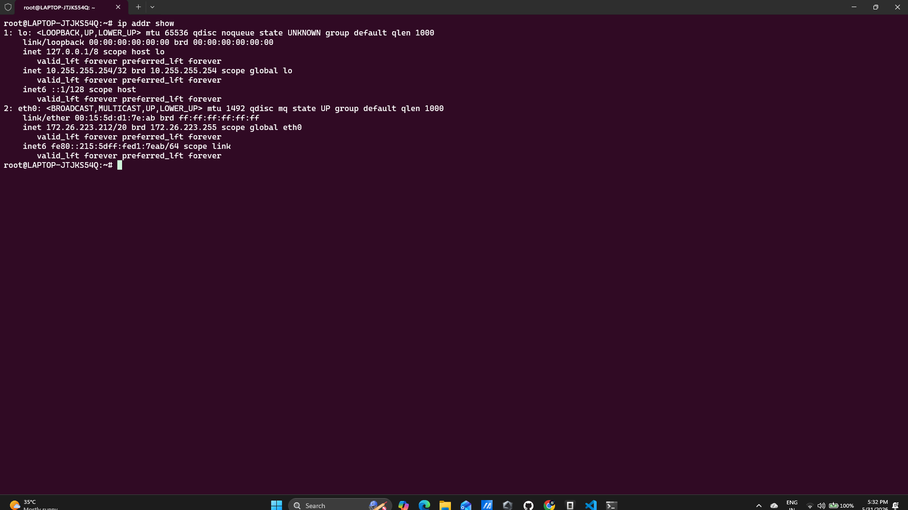
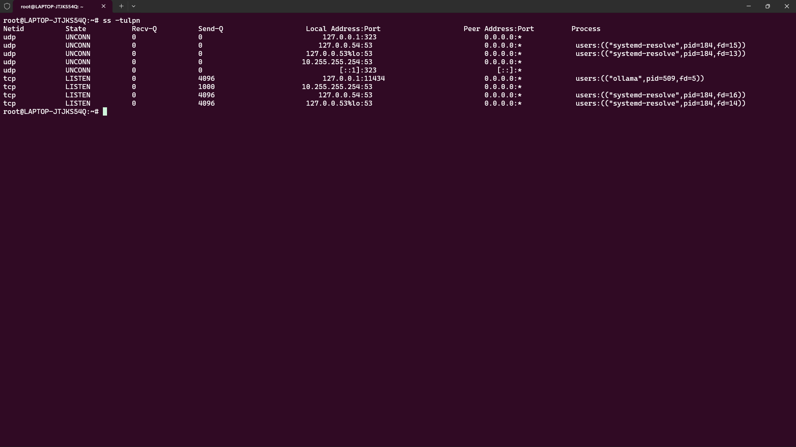

# Day 15 – Networking Concepts: DNS, IP, Subnets & Ports

## Task 1: DNS – How Names Become IPs

### 1. What happens when you type `google.com` in a browser?

When I type `google.com` in a browser, the browser first checks its cache for the IP address. If it doesn't find it, it asks a DNS resolver to find the IP. The resolver queries DNS servers until it finds the correct record. Once the IP address is returned, the browser connects to that IP and loads the website.

### 2. DNS Record Types

| Record Type | Purpose                                                 |
| ----------- | ------------------------------------------------------- |
| A           | Maps a domain name to an IPv4 address                   |
| AAAA        | Maps a domain name to an IPv6 address                   |
| CNAME       | Creates an alias from one domain name to another        |
| MX          | Specifies mail servers responsible for receiving emails |
| NS          | Identifies the authoritative name servers for a domain  |

### 3. `dig google.com` Output

```bash
$ dig google.com
```
### 2. Expected Output 

google.com.     300     IN      A       142.250.183.14


**A Record:** `142.250.182.110`

**TTL:** `174 seconds`

### Screenshot


---

# Task 2: IP Addressing

### 1. What is an IPv4 Address?

An IPv4 address is a 32-bit numerical identifier assigned to a device on a network. It consists of four octets separated by dots, such as `192.168.1.10`, where each octet ranges from 0 to 255.

### 2. Public vs Private IP Addresses

| Type       | Description                                                   | Example         |
| ---------- | ------------------------------------------------------------- | --------------- |
| Public IP  | Accessible over the internet and globally unique              | `8.8.8.8`       |
| Private IP | Used within private networks and not routable on the internet | `192.168.1.100` |

### 3. Private IP Ranges

```text
10.0.0.0 - 10.255.255.255
172.16.0.0 - 172.31.255.255
192.168.0.0 - 192.168.255.255
```

### 4. `ip addr show`

Example output:

```bash
$ ip addr show
```
### Expected Output

```text
1. inet 10.255.255.254/32 scope global lo
2. inet 172.26.223.212/20 scope global eth0
```

**Private IPs identified:**

* `10.255.255.254`
* `172.26.223.212`

Both belong to private IP ranges.

### Screenshot



---

# Task 3: CIDR & Subnetting

### 1. What does `/24` mean in `192.168.1.0/24`?

`/24` means the first 24 bits are used for the network portion of the address, leaving 8 bits for host addresses.

### 2. Usable Hosts

| CIDR | Usable Hosts |
| ---- | ------------ |
| /24  | 254          |
| /16  | 65,534       |
| /28  | 14           |

Formula:

```text
Usable Hosts = 2^(Host Bits) - 2
```

### 3. Why Do We Subnet?

Subnetting divides a large network into smaller networks. It improves organization, reduces broadcast traffic, enhances security, and allows efficient utilization of IP addresses.

### 4. CIDR Table

| CIDR | Subnet Mask     | Total IPs | Usable Hosts |
| ---- | --------------- | --------- | ------------ |
| /24  | 255.255.255.0   | 256       | 254          |
| /16  | 255.255.0.0     | 65,536    | 65,534       |
| /28  | 255.255.255.240 | 16        | 14           |

---

# Task 4: Ports – The Doors to Services

### 1. What is a Port?

A port is a logical communication endpoint used by applications and services on a device. Ports allow multiple services to use the same IP address while keeping network traffic organized.

### 2. Common Ports

| Port  | Service |
| ----- | ------- |
| 22    | SSH     |
| 80    | HTTP    |
| 443   | HTTPS   |
| 53    | DNS     |
| 3306  | MySQL   |
| 6379  | Redis   |
| 27017 | MongoDB |

### 3. `ss -tulpn` Output

Example:

```bash
$ ss -tulpn
```
### Expected Output

```text
tcp LISTEN 0 4096 127.0.0.1:11434 0.0.0.0:* users:(("ollama",pid=509,fd=5))
tcp LISTEN 0 4096 127.0.0.54:53 0.0.0.0:* users:(("systemd-resolve",pid=184,fd=16))
udp UNCONN 0 0 127.0.0.54:53 0.0.0.0:* users:(("systemd-resolve",pid=184,fd=15))
```

Matched Services:

| Port | Service |
|------|---------|
| 53 | DNS Resolver (systemd-resolve) |
| 11434 | Ollama AI Model Server |

### Screenshot



---

# Task 5: Putting It Together

### 1. You run `curl http://myapp.com:8080` — what networking concepts are involved?

The DNS system resolves `myapp.com` to an IP address. The client then connects to that IP using TCP port `8080`. Routing, IP addressing, and port communication are all involved before the HTTP request reaches the application.

### 2. Your app can't reach a database at `10.0.1.50:3306` — what would you check first?

I would first verify network connectivity to `10.0.1.50` using `ping` or `telnet/nc`. Then I would check whether MySQL is listening on port `3306`, confirm firewall/security group rules, and ensure routing between the application and database networks is correct.

---

# What I Learned

### 1.

DNS translates human-readable domain names into IP addresses, allowing browsers to locate servers on the internet.

### 2.

CIDR notation determines network size and available host addresses, making IP allocation more efficient.

### 3.

Ports allow multiple services to run on a single machine while keeping network communication organized and isolated.

---

# Commands Used

```bash
dig google.com

ip addr show

ss -tulpn
```
