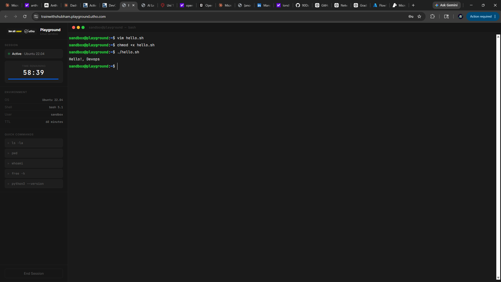
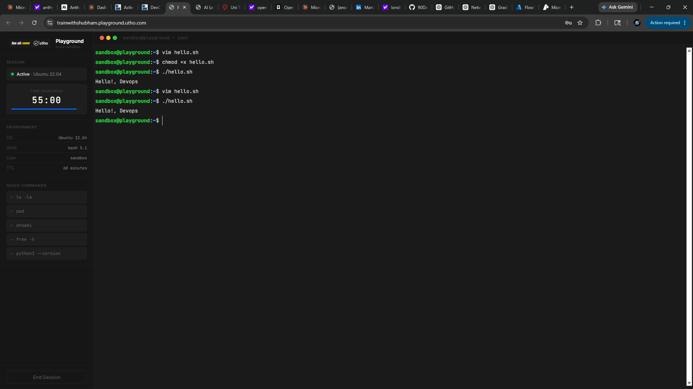
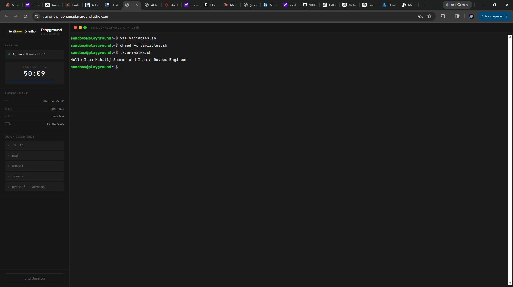
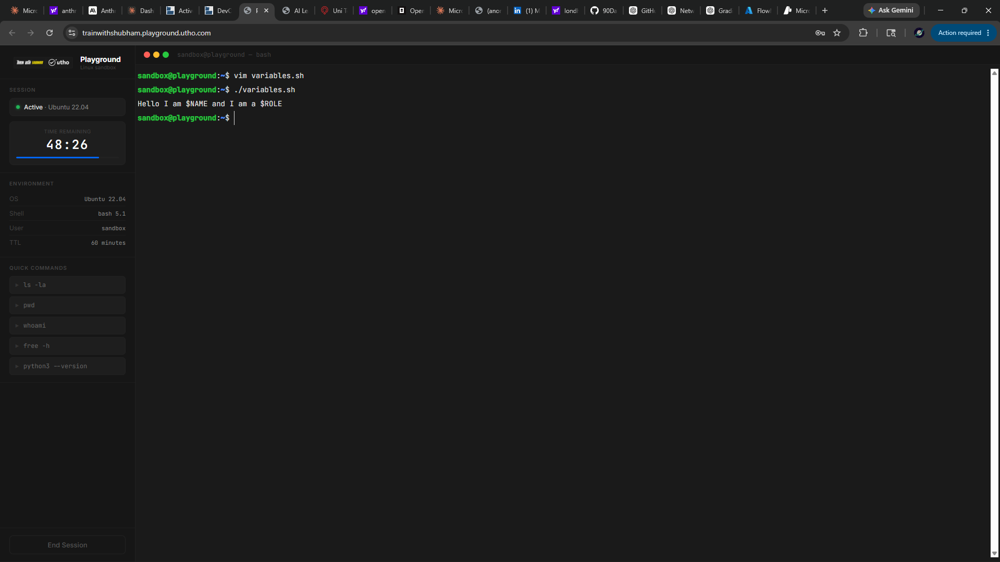
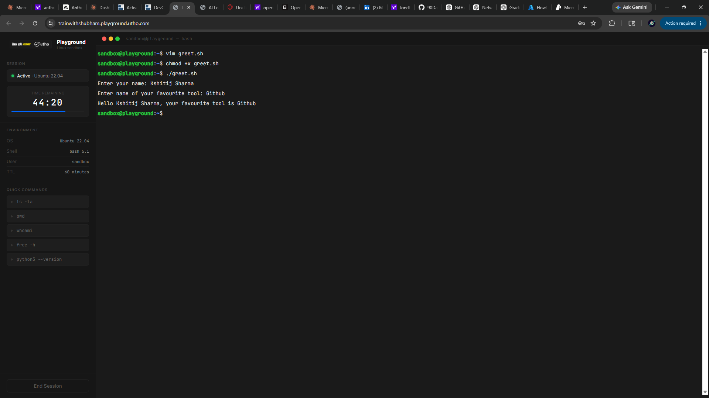
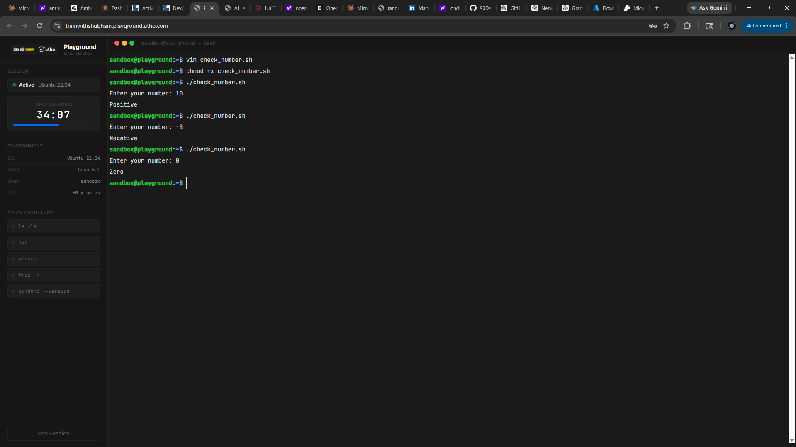
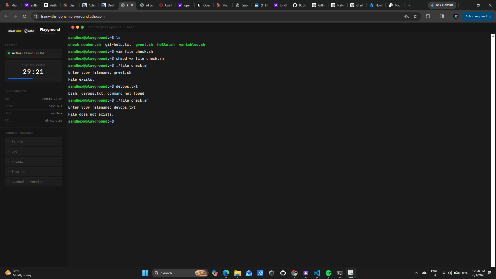

# Day 16 – Shell Scripting Basics

## Objective

Today I started learning Shell Scripting fundamentals. The goal was to understand how Bash scripts work, how to use variables, accept user input, and implement decision-making using if-else conditions.

---

# Task 1: Your First Script

## hello.sh

```bash
#!/bin/bash

echo "Hello, DevOps!"
```

### Make Executable

```bash
chmod +x hello.sh
```

### Run Script

```bash
./hello.sh
```

### Output

```text
Hello, DevOps!
```

## Screenshot



### What I Learned

The first line:

```bash
#!/bin/bash
```

is called the **Shebang**.

It tells the operating system which interpreter should execute the script.

### What Happens If the Shebang Is Removed?

If the script is executed using:

```bash
./hello.sh
```

it still works because Bash is explicitly provided.



---

# Task 2: Variables

## variables.sh

```bash
#!/bin/bash

NAME="Kshitij"
ROLE="DevOps Engineer"

echo "Hello, I am $NAME and I am a $ROLE"
```

### Run Script

```bash
./variables.sh
```

### Output

```text
Hello, I am Kshitij and I am a DevOps Engineer
```

---

## Single Quotes vs Double Quotes

### Example

```bash
NAME="Kshitij"

echo 'Hello, I am $NAME'
echo "Hello, I am $NAME"
```

### Output

```text
Hello, I am $NAME
Hello, I am Kshitij
```


### Difference

#### Single Quotes

```bash
' '
```

Treat everything literally.

Variables are not expanded.

#### Double Quotes

```bash
" "
```

Allow variable expansion and command substitution.

Variables are replaced with their values.

---

# Task 3: User Input Using read

## greet.sh

```bash
#!/bin/bash

read -p "Enter your name: " name
read -p "Enter your favourite tool: " tool

echo "Hello $name, your favourite tool is $tool"
```

### Run Script

```bash
./greet.sh
```

### Sample Output

```text
Enter your name: Kshitij
Enter your favourite tool: Docker

Hello Kshitij, your favourite tool is Docker
```


### What I Learned

The `read` command allows us to accept input from the user during script execution.

---

# Task 4: If-Else Conditions

## check_number.sh

### Script

```bash
#!/bin/bash

read -p "Enter a number: " num

if [ "$num" -gt 0 ]; then
    echo "Positive"
elif [ "$num" -lt 0 ]; then
    echo "Negative"
else
    echo "Zero"
fi
```

### Sample Outputs

#### Positive Number

```text
Enter a number: 5
Positive
```

#### Negative Number

```text
Enter a number: -8
Negative
```

#### Zero

```text
Enter a number: 0
Zero
```


### What I Learned

Bash supports conditional statements using:

```bash
if
elif
else
fi
```

These statements help scripts make decisions based on conditions.

---

## file_check.sh

### Script

```bash
#!/bin/bash

read -p "Enter filename: " filename

if [ -f "$filename" ]; then
    echo "File exists."
else
    echo "File does not exist."
fi
```

### Sample Output

#### Existing File

```text
Enter filename: notes.txt
File exists.
```

#### Non-Existing File

```text
Enter filename: demo.txt
File does not exist.
```



### What I Learned

The `-f` flag checks whether a file exists and is a regular file.

---

# Task 5: Combine Everything

## server_check.sh

### Script

```bash
#!/bin/bash

SERVICE="nginx"

read -p "Do you want to check the status? (y/n): " choice

if [ "$choice" = "y" ]; then
    echo "Checking service status..."

    if systemctl is-active --quiet "$SERVICE"; then
        echo "$SERVICE is active."
    else
        echo "$SERVICE is not active."
    fi

elif [ "$choice" = "n" ]; then
    echo "Skipped."
else
    echo "Invalid choice."
fi
```

### Note

While performing this task on Windows Git Bash, the following error occurred:

```text
systemctl: command not found
```

This happened because `systemctl` is available only on Linux systems using `systemd`.

To fully execute this script, a Linux environment such as Ubuntu, CentOS, Rocky Linux, or a WSL setup with systemd enabled is required.

### Expected Output on Linux

```text
Do you want to check the status? (y/n): y

nginx is active.
```

or

```text
Do you want to check the status? (y/n): y

nginx is not active.
```

---

# Key Learnings

### 1. Importance of Shebang

The shebang line tells the operating system which interpreter should execute the script.

Example:

```bash
#!/bin/bash
```

---

### 2. Variables and User Input

Variables store data while the `read` command allows user interaction.

Example:

```bash
NAME="Kshitij"

read NAME
```

---

### 3. Conditional Statements

Using `if-else` conditions allows scripts to make decisions and automate tasks based on different scenarios.

Example:

```bash
if [ condition ]; then
    command
else
    command
fi
```

---

# Conclusion

Today I learned the foundational concepts of Shell Scripting including:

* Creating executable Bash scripts
* Understanding the purpose of the shebang line
* Using variables and displaying output with echo
* Taking user input using read
* Implementing conditional logic using if-else statements
* Checking file existence and service status

These concepts form the foundation for automation and DevOps scripting, which will be expanded upon in future tasks.

#90DaysOfDevOps #DevOpsKaJosh #TrainWithShubham
