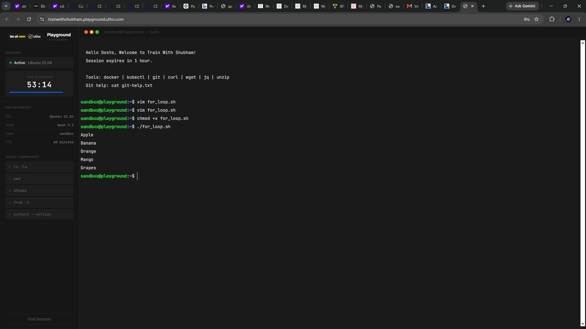
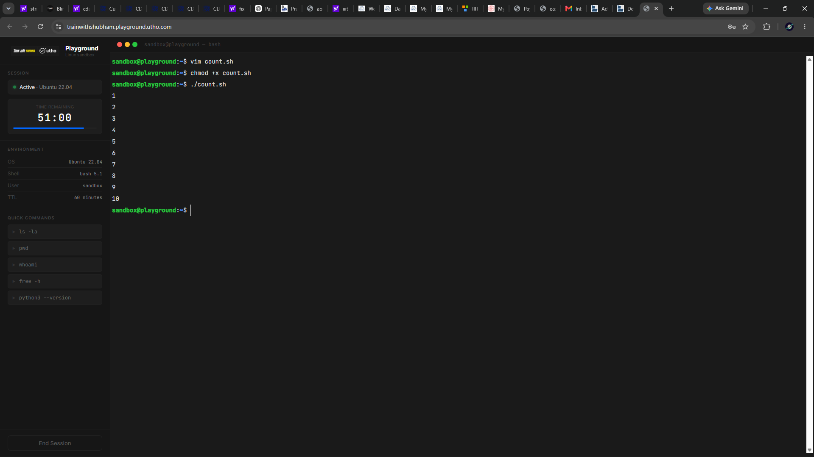
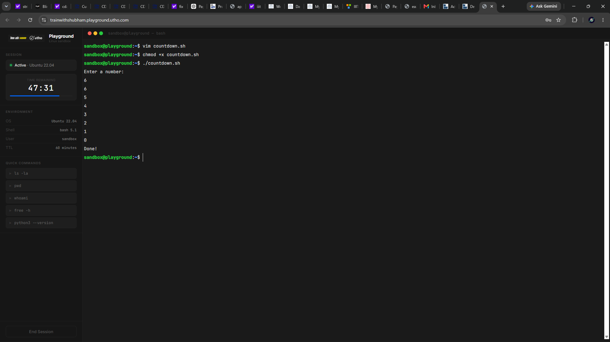
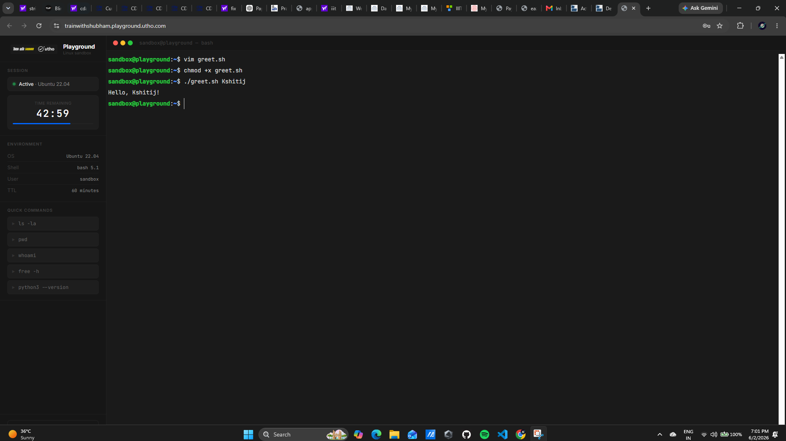
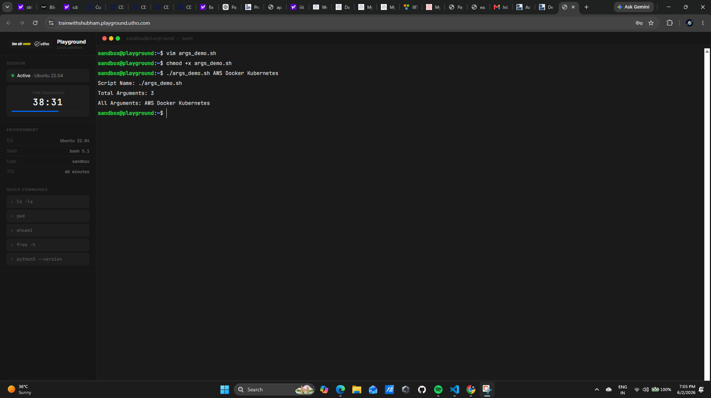
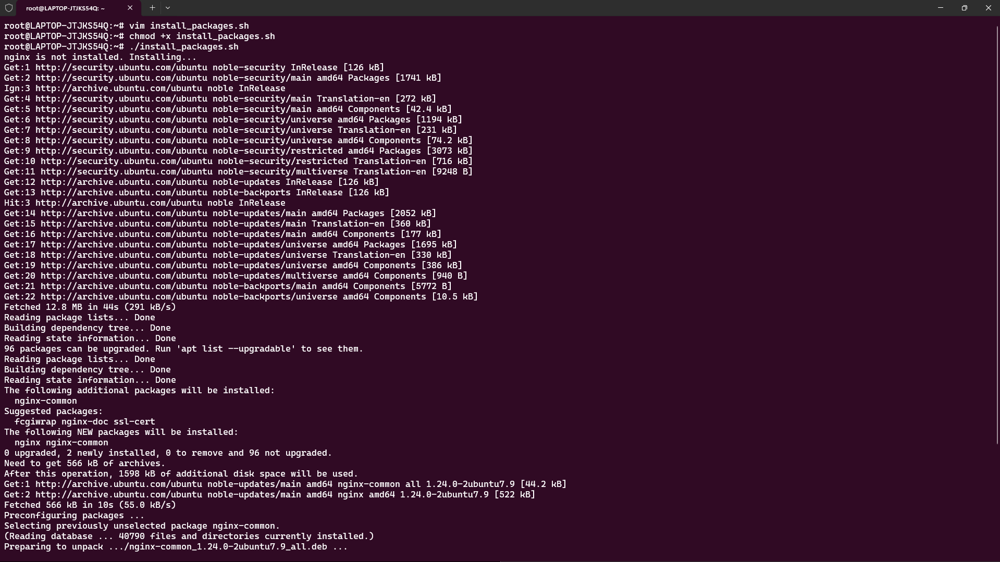

# Day 17 - Shell Scripting: Loops, Arguments & Error Handling

## Objective

The objective of this task was to understand and implement some of the most commonly used shell scripting concepts in Linux and DevOps environments. During this exercise, I worked with loops, command-line arguments, package installation automation, and error handling techniques that are frequently used in production automation scripts.

---

# Task 1: For Loop

## Script 1: for_loop.sh

### Purpose

The purpose of this script is to iterate through a predefined list of fruits and print each fruit one by one using a **for loop**.

### Code

```bash
#!/bin/bash

fruits=("Apple" "Banana" "Mango" "Orange" "Grapes")

for fruit in "${fruits[@]}"
do
    echo "$fruit"
done
```

### Explanation

* An array named `fruits` is created.
* `${fruits[@]}` represents all elements of the array.
* The `for` loop iterates through each element.
* `echo` prints the current fruit.

### Output

```bash
Apple
Banana
Mango
Orange
Grapes
```

### Screenshot



### Learning

For loops are useful when the same operation needs to be performed on multiple items.

---

## Script 2: count.sh

### Purpose

Print numbers from 1 to 10 using a for loop.

### Code

```bash
#!/bin/bash

for i in {1..10}
do
    echo $i
done
```

### Explanation

* `{1..10}` generates numbers from 1 to 10.
* The loop iterates over each number.
* Each value is printed using `echo`.

### Output

```bash
1
2
3
4
5
6
7
8
9
10
```

### Screenshot



### Learning

For loops simplify repetitive tasks and reduce manual coding effort.

---

# Task 2: While Loop

## Script: countdown.sh

### Purpose

Take a number as input from the user and count down to zero using a while loop.

### Code

```bash
#!/bin/bash

echo "Enter a number:"
read num

while [ $num -ge 0 ]
do
    echo $num
    ((num--))
done

echo "Done!"
```

### Explanation

* `read num` takes input from the user.
* The condition checks whether the number is greater than or equal to zero.
* `((num--))` decreases the value by one after each iteration.
* The loop terminates when the value becomes less than zero.

### Output

```bash
Enter a number:
5

5
4
3
2
1
0

Done!
```

### Screenshot



### Learning

While loops are useful when the number of iterations is unknown and depends on a condition.

---

# Task 3: Command-Line Arguments

Command-line arguments allow scripts to receive values directly during execution.

---

## Script: greet.sh

### Purpose

Accept a username from the command line and display a greeting message.

### Code

```bash
#!/bin/bash

if [ $# -eq 0 ]
then
    echo "Usage: ./greet.sh <name>"
else
    echo "Hello, $1!"
fi
```

### Explanation

* `$#` gives the total number of arguments.
* If no argument is passed, the script displays usage instructions.
* `$1` represents the first command-line argument.

### Output

```bash
./greet.sh Kshitij

Hello, Kshitij!
```

### Screenshot



### Learning

Input validation improves script usability and prevents unexpected execution.

---

## Script: args_demo.sh

### Purpose

Demonstrate commonly used shell variables for command-line arguments.

### Code

```bash
#!/bin/bash

echo "Script Name: $0"
echo "Total Arguments: $#"
echo "All Arguments: $@"
```

### Explanation

| Variable | Description               |
| -------- | ------------------------- |
| $0       | Script Name               |
| $1       | First Argument            |
| $2       | Second Argument           |
| $#       | Total Number of Arguments |
| $@       | All Arguments             |

### Output

```bash
./args_demo.sh AWS Docker Kubernetes

Script Name: ./args_demo.sh
Total Arguments: 3
All Arguments: AWS Docker Kubernetes
```

### Screenshot



### Learning

Command-line arguments make scripts reusable and flexible.

---

# Task 4: Package Installation Automation

## Script: install_packages.sh

### Purpose

Automatically check whether required packages are installed and install missing packages.

### Code

```bash
#!/bin/bash

if [ "$EUID" -ne 0 ]
then
    echo "Please run as root"
    exit 1
fi

packages=("nginx" "curl" "wget")

for pkg in "${packages[@]}"
do
    if dpkg -s "$pkg" &>/dev/null
    then
        echo "$pkg is already installed."
    else
        echo "$pkg is not installed. Installing..."

        apt update -y
        apt install -y "$pkg"

        if [ $? -eq 0 ]
        then
            echo "$pkg installed successfully."
        else
            echo "Failed to install $pkg"
        fi
    fi
done
```

### Explanation

* Root privilege verification is performed using `$EUID`.
* Package names are stored in an array.
* The script checks package availability using `dpkg -s`.
* Missing packages are automatically installed.
* Installation status is displayed.

### Output

```bash
curl is already installed.
wget is already installed.
nginx is not installed.
Installing nginx...
nginx installed successfully.
```

### Screenshot



### Learning

Package automation is a common DevOps task and helps standardize environments.

---

# Task 5: Error Handling

## Script: safe_script.sh

### Purpose

Implement basic error handling using `set -e` and conditional operators.

### Code

```bash
#!/bin/bash

set -e

mkdir /tmp/devops-test || echo "Directory already exists"

cd /tmp/devops-test || {
    echo "Failed to enter directory"
    exit 1
}

touch demo.txt || {
    echo "Failed to create file"
    exit 1
}

echo "Script completed successfully"
```

### Explanation

#### set -e

Stops script execution immediately if any command fails.

#### ||

Executes the next command if the previous command fails.

Example:

```bash
mkdir folder || echo "Folder already exists"
```

### Output

```bash
Script completed successfully
```

### Screenshot


### Learning

Error handling prevents scripts from continuing when critical operations fail.

---

# Key Concepts Learned

## 1. Loops Help Automate Repetitive Tasks

Using for and while loops reduces manual effort and improves script efficiency.

## 2. Command-Line Arguments Improve Reusability

Variables such as `$1`, `$2`, `$#`, and `$@` allow scripts to accept dynamic input from users.

## 3. Error Handling Improves Reliability

Using `set -e`, exit codes, and conditional operators helps create production-ready scripts.

## 4. Automation Saves Time

Package installation and configuration tasks can be automated instead of being performed manually.

## 5. Root Validation Enhances Security

Checking user privileges before executing administrative operations prevents unauthorized changes.

---

# Conclusion

Day 17 focused on practical shell scripting concepts that are widely used in Linux administration, DevOps automation, and infrastructure management. Through loops, command-line arguments, package management automation, and error handling, I gained a better understanding of how production-grade shell scripts are written and maintained.

#90DaysOfDevOps #DevOpsKaJosh #TrainWithShubham #ShellScripting #Linux #Automation #DevOps
