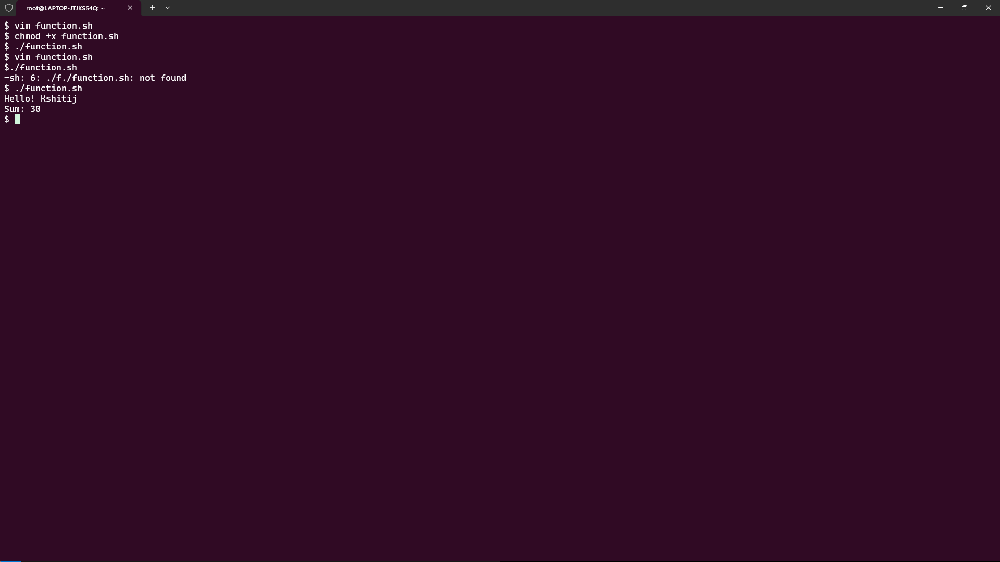
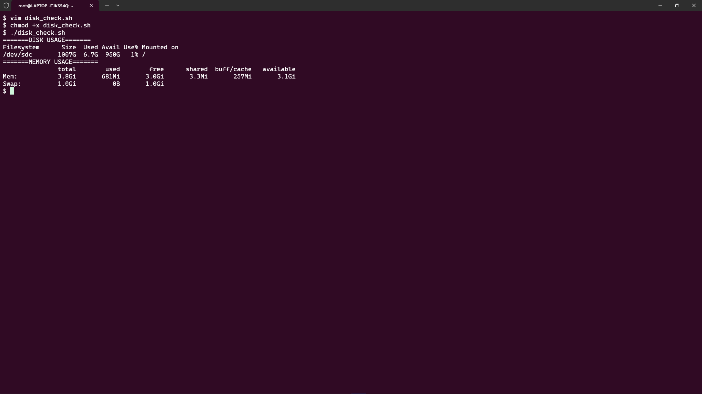
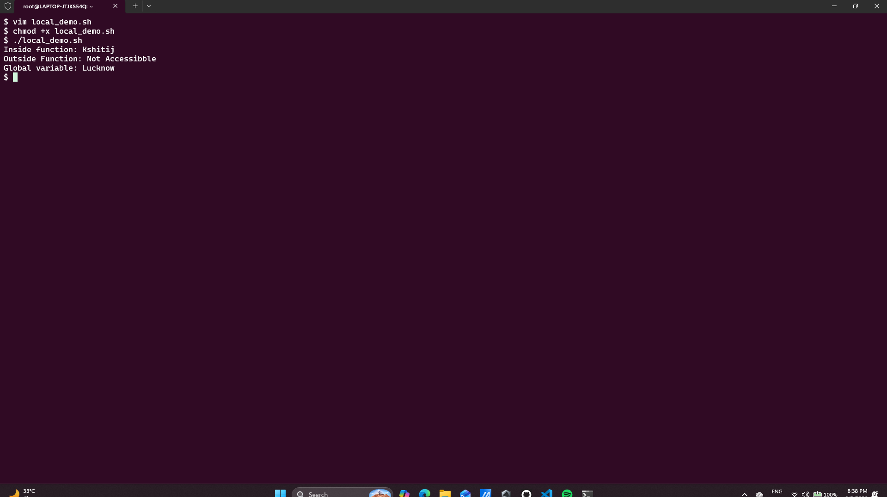
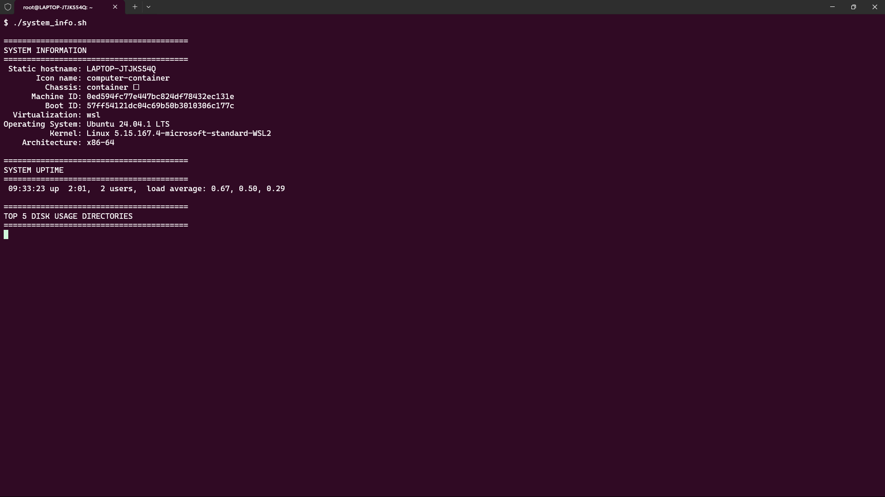

# Day 18 – Shell Scripting: Functions, Strict Mode & Production-Ready Scripts

As shell scripts grow larger, writing everything line by line quickly becomes difficult to maintain. Functions help organize code, reduce repetition, and make scripts reusable. Along with functions, strict mode (`set -euo pipefail`) is one of the most important concepts for writing reliable production-grade shell scripts.

In this exercise, I explored functions, local variables, strict mode, and built a complete System Information Reporter.

---

# Task 1: Basic Functions

Functions allow us to write reusable blocks of code that can be called whenever needed.

## functions.sh

```bash
#!/bin/bash

greet() {
    echo "Hello, $1!"
}

add() {
    local sum=$(( $1 + $2 ))
    echo "Sum: $sum"
}

greet "Kshitij"
add 10 20
```

## Output

```text
Hello, Kshitij!
Sum: 30
```
### Screenshot



### Key Learning

* Functions improve readability.
* Code can be reused multiple times.
* Arguments can be passed using `$1`, `$2`, etc.

---

# Task 2: Disk & Memory Check Functions

Instead of running commands manually, we can create reusable monitoring functions.

## disk_check.sh

```bash
#!/bin/bash

check_disk() {
    echo "========== DISK USAGE =========="
    df -h /
}

check_memory() {
    echo
    echo "========== MEMORY USAGE =========="
    free -h
}

check_disk
check_memory
```

## Output

```text
=======DISK USAGE=======
Filesystem      Size  Used Avail Use% Mounted on
/dev/sdc       1007G  6.7G  950G   1% /
=======MEMORY USAGE=======
               total        used        free      shared  buff/cache   available
Mem:           3.8Gi       681Mi       3.0Gi       3.3Mi       257Mi       3.1Gi
Swap:          1.0Gi          0B       1.0Gi
```
### Screenshot



### Why This Matters

System administrators and DevOps engineers frequently monitor disk and memory utilization. Wrapping these checks into functions makes scripts easier to maintain and extend.

---

# Task 3: Understanding Strict Mode

One of the most important lessons in shell scripting is writing scripts that fail safely.

## strict_demo.sh

```bash
#!/bin/bash

set -euo pipefail

echo "Strict Mode Enabled"

echo "$MY_VAR"

false

echo "This line will never execute"
```

---

## What Does Strict Mode Do?

### 1. set -e

Exit immediately if any command fails.

```bash
set -e
```

Example:

```bash
false
echo "This will never execute"
```

Output:

```text
Script exits immediately
```

---

### 2. set -u

Exit when an undefined variable is used.

```bash
set -u
```

Example:

```bash
echo "$UNDEFINED_VARIABLE"
```

Output:

```text
UNDEFINED_VARIABLE: unbound variable
```

---

### 3. set -o pipefail

Normally only the last command in a pipeline determines success.

```bash
cat missing.txt | grep test
```

Without pipefail:

```text
Pipeline may appear successful
```

With pipefail:

```bash
set -o pipefail
```

Output:

```text
cat: missing.txt: No such file or directory
Script exits with failure
```

---

## Production Best Practice

Always start serious shell scripts with:

```bash
set -euo pipefail
```

This single line prevents many hidden bugs and makes scripts significantly more reliable.

---

# Task 4: Local Variables

Functions should not accidentally modify variables outside their scope.

## local_demo.sh

```bash
#!/bin/bash

show_local() {
    local name="Kshitij"
    echo "Inside Function: $name"
}

show_global() {
    city="Lucknow"
}

show_local

echo "Outside Function: ${name:-Not Accessible}"

show_global

echo "Global Variable: $city"
```

## Output

```text
Inside Function: Kshitij
Outside Function: Not Accessible
Global Variable: Lucknow
```

### Screenshot



### Key Learning

Using `local` prevents variables from leaking outside functions.

Good Practice:

```bash
local variable_name
```

Bad Practice:

```bash
variable_name="value"
```

because it becomes globally accessible.

---

# Task 5: System Information Reporter

This script combines everything learned so far into a practical project.

## system_info.sh

```bash
#!/bin/bash

set -euo pipefail

print_header() {
    echo
    echo "========================================"
    echo "$1"
    echo "========================================"
}

system_info() {
    print_header "SYSTEM INFORMATION"
    hostnamectl | head -10
}

uptime_info() {
    print_header "SYSTEM UPTIME"
    uptime
}

disk_usage() {
    print_header "TOP 5 DISK USAGE DIRECTORIES"
    du -sh /* 2>/dev/null | sort -hr | head -5
}

memory_usage() {
    print_header "MEMORY USAGE"
    free -h
}

cpu_usage() {
    print_header "TOP 5 CPU CONSUMING PROCESSES"
    ps aux --sort=-%cpu | head -6
}

main() {
    system_info
    uptime_info
    disk_usage
    memory_usage
    cpu_usage
}

main
```

---

## Sample Output

```text
========================================
SYSTEM INFORMATION
========================================

Hostname: ubuntu
Operating System: Ubuntu 24.04

========================================
SYSTEM UPTIME
========================================

up 5 days, 2 hours

========================================
TOP 5 DISK USAGE DIRECTORIES
========================================

15G /var
8G  /home
4G  /usr

========================================
MEMORY USAGE
========================================

15Gi total
5Gi used
8Gi free

========================================
TOP 5 CPU CONSUMING PROCESSES
========================================

root      1234 40.0
ubuntu    5678 20.0
```

### Screenshot



---

# Key Takeaways

### 1. Functions Improve Maintainability

Instead of repeating commands, we can write reusable functions and call them whenever required.

### 2. Strict Mode Makes Scripts Production Ready

Using:

```bash
set -euo pipefail
```

helps catch errors early and prevents unexpected behavior.

### 3. Local Variables Reduce Bugs

Variables inside functions should remain inside functions. Using `local` improves script reliability and readability.

---

# Final Thought

A beginner writes scripts that work.

A professional writes scripts that continue working when something goes wrong.

Understanding functions, strict mode, and variable scope is what transforms a basic shell script into a production-ready automation tool.

#90DaysOfDevOps #DevOpsKaJosh #TrainWithShubham #ShellScripting #Linux #Automation #DevOps
