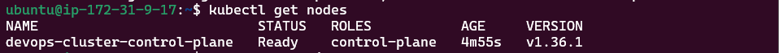
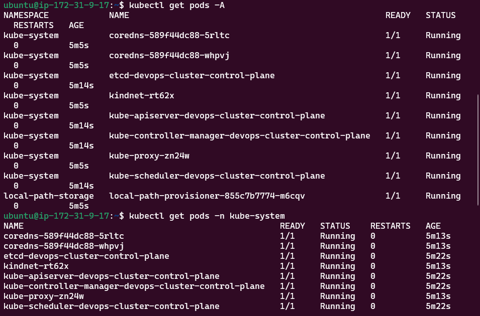

# Day 50 – Kubernetes Architecture and Cluster Setup

## Objective

Today marked the beginning of my Kubernetes journey. After learning how Docker packages applications into containers, I explored how Kubernetes orchestrates and manages containers at scale. I set up a local Kubernetes cluster, learned the core architecture, and used `kubectl` to interact with the cluster.

---

# Task 1 – The Kubernetes Story

## 1. Why was Kubernetes created?

Docker makes it easy to package and run containers, but managing hundreds or thousands of containers across multiple servers becomes difficult. Kubernetes was created to automate container deployment, scaling, networking, self-healing, and lifecycle management across a cluster of machines.

---

## 2. Who created Kubernetes?

Kubernetes was originally developed by **Google** and later donated to the **Cloud Native Computing Foundation (CNCF)**. It was inspired by Google's internal cluster management system called **Borg**, which had been managing containers in production for many years.

---

## 3. What does Kubernetes mean?

The word **Kubernetes** comes from the Greek language and means **"Helmsman"** or **"Pilot"**, symbolizing someone who steers a ship. This aligns with Kubernetes' role in orchestrating and managing containers.

---

# Kubernetes History (In My Own Words)

Docker solved the problem of packaging applications into portable containers, but it did not provide a way to manage large numbers of containers across multiple machines. Google built Kubernetes based on lessons learned from its Borg system to automate container orchestration. Today, Kubernetes is the industry-standard platform for deploying, scaling, and managing containerized applications.

---

# Task 2 – Kubernetes Architecture

## Kubernetes Architecture Diagram

```text
                        +-----------------------------+
                        |        kubectl CLI          |
                        +-------------+---------------+
                                      |
                                      v
                         +---------------------------+
                         |        API Server         |
                         +---------------------------+
                                      |
             +------------------------+------------------------+
             |                        |                        |
             v                        v                        v
       +------------+          +-------------+        +------------------+
       |    etcd    |          | Scheduler   |        | Controller Mgr   |
       +------------+          +-------------+        +------------------+
                                      |
                                      v
               ---------------------------------------------------
               |                                                 |
               v                                                 v
      +--------------------+                          +--------------------+
      |    Worker Node 1   |                          |    Worker Node 2   |
      |--------------------|                          |--------------------|
      | kubelet            |                          | kubelet            |
      | kube-proxy         |                          | kube-proxy         |
      | containerd / CRI-O |                          | containerd / CRI-O |
      | Pods               |                          | Pods               |
      +--------------------+                          +--------------------+
```

---

## Control Plane Components

### API Server

* Entry point to the Kubernetes cluster.
* Receives all requests from `kubectl` and other components.
* Validates and processes API requests.

---

### etcd

* Distributed key-value database.
* Stores the complete state of the Kubernetes cluster.
* Acts as the single source of truth.

---

### Scheduler

* Watches for newly created Pods.
* Selects the most appropriate worker node based on available resources and scheduling policies.

---

### Controller Manager

* Continuously monitors the cluster.
* Ensures the actual state matches the desired state.
* Recreates failed Pods and manages ReplicaSets, Nodes, Endpoints, etc.

---

## Worker Node Components

### kubelet

* Agent running on every worker node.
* Receives instructions from the API Server.
* Creates and monitors Pods.

---

### kube-proxy

* Manages networking rules.
* Enables communication between Pods and Services.

---

### Container Runtime

Examples:

* containerd
* CRI-O

Responsible for pulling container images and running containers.

---

# What Happens When You Run?

```bash
kubectl apply -f pod.yaml
```

Execution Flow:

1. `kubectl` sends the request to the API Server.
2. API Server validates the YAML manifest.
3. Desired state is stored inside **etcd**.
4. Scheduler selects the best worker node.
5. kubelet receives instructions.
6. Container Runtime pulls the image.
7. Pod starts running.
8. kube-proxy configures networking.
9. Kubernetes continuously monitors the Pod.

---

# What If the API Server Goes Down?

* No new resources can be created or modified.
* `kubectl` commands fail.
* Existing Pods continue running.
* Cluster management operations stop until the API Server becomes available again.

---

# What If a Worker Node Goes Down?

* Node becomes **NotReady**.
* Controller Manager detects the failure.
* Scheduler creates replacement Pods on healthy nodes (if available).
* Applications continue running with minimal disruption.

---

# Task 3 – Installing kubectl

Installed `kubectl` to interact with the Kubernetes cluster.

Verification:

```bash
kubectl version --client
```

---

# Task 4 – Local Kubernetes Cluster

## Tool Chosen

**kind (Kubernetes IN Docker)**

### Why I chose kind

* Lightweight
* Fast startup
* Uses Docker containers instead of virtual machines
* Perfect for learning Kubernetes locally
* Widely used for testing and CI/CD environments

---

## Cluster Creation

```bash
kind create cluster --name devops-cluster
```

---

## Verify Cluster

```bash
kubectl cluster-info

kubectl get nodes
```

---

# Task 5 – Exploring the Cluster

Useful commands executed:

```bash
kubectl cluster-info

kubectl get nodes

kubectl describe node <node-name>

kubectl get namespaces

kubectl get pods -A

kubectl get pods -n kube-system
```

---

# kube-system Components

| Pod                               | Purpose                                   |
| --------------------------------- | ----------------------------------------- |
| kube-apiserver                    | Entry point for all cluster communication |
| etcd                              | Stores cluster state                      |
| kube-scheduler                    | Schedules Pods onto worker nodes          |
| kube-controller-manager           | Maintains desired cluster state           |
| kube-proxy                        | Handles Pod networking and Services       |
| CoreDNS                           | Internal DNS service for Kubernetes       |
| coredns-autoscaler *(if present)* | Scales CoreDNS deployment                 |
| kindnet *(kind only)*             | Provides networking inside kind clusters  |

---

# Task 6 – Cluster Lifecycle

Delete cluster:

```bash
kind delete cluster --name devops-cluster
```

Create again:

```bash
kind create cluster --name devops-cluster
```

Verify:

```bash
kubectl get nodes
```

---

# Useful kubectl Commands

Current context:

```bash
kubectl config current-context
```

All contexts:

```bash
kubectl config get-contexts
```

View kubeconfig:

```bash
kubectl config view
```

---

# What is kubeconfig?

A **kubeconfig** file stores information about Kubernetes clusters, users, authentication credentials, and contexts. It allows `kubectl` to know which cluster to connect to and how to authenticate.

Default location:

```text
~/.kube/config
```

---

# Repository Structure

```text
2026/
└── day-50/
    ├── day-50-k8s-setup.md
    ├── kubectl-get-nodes.png
    └── kube-system-pods.png
```

---

# Verification Checklist

* ✅ Installed kubectl
* ✅ Created a local Kubernetes cluster
* ✅ Verified cluster using `kubectl cluster-info`
* ✅ Listed Kubernetes nodes
* ✅ Explored namespaces
* ✅ Listed kube-system Pods
* ✅ Understood Kubernetes architecture
* ✅ Practiced cluster creation and deletion
* ✅ Learned about kubeconfig

---

# Screenshots

## kubectl get nodes



---

## kube-system Pods



---

# Key Learnings

* Kubernetes is a container orchestration platform designed to automate deployment, scaling, and management of containerized applications.
* The API Server is the central communication hub for the cluster.
* etcd stores the desired state of the cluster.
* The Scheduler decides where Pods should run.
* kubelet manages Pods on worker nodes.
* kube-proxy enables networking between Pods and Services.
* `kubectl` is the primary CLI tool for interacting with Kubernetes.
* A local cluster created with **kind** provides a production-like environment for learning Kubernetes concepts.